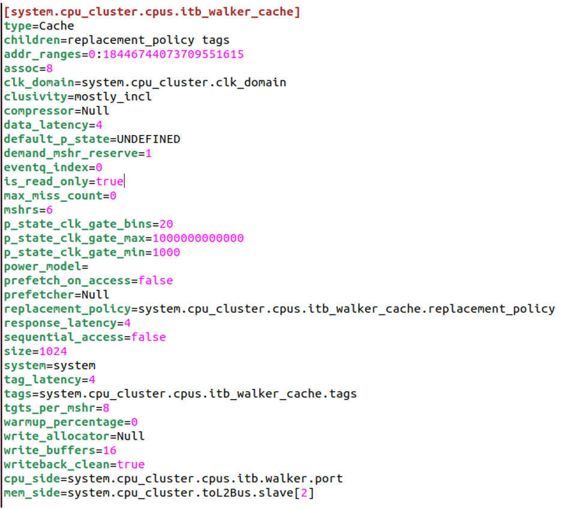

  

 
ΚΌΚΚΙΝΟΣ ΚΥΡΙΆΚΟΣ, 10426

<u>**Ερωτήματα Πρώτου Μέρους:**</u>

**1. Ανοίξτε το αρχείο starter_se.py που χρησιμοποιήσατε στο παράδειγμα του Hello World και προσπαθήστε να καταλάβετε ποιες είναι βασικές παράμετροι που έχει περάσει στον gem5 για το σύστημα προς εξομοίωση. Καταγράψτε τα βασικά χαρακτηριστικά του συστήματος, όπως τύπος CPU, συχνότητα λειτουργίας, βασικές μονάδες, caches, μνήμη κτλ.**

Καταρχάς, πριν αναζητήσουμε τα χαρακτηριστικά του συστήματος στο starter_se.py στην εντολή του build, κάναμε χρήση του flag -–cpu=”minor”, άρα ορίσαμε τον τύπο του cpu σε minor. Ο συγκεκριμένος τύπος CPU έχει ξεχωριστές L1 instruction και data cache και L2 cache.

  

  

Για τα υπόλοιπα, αφού δεν τα ορίσαμε εμείς, το gem5 θα χρησιμοποιήσει τις default τιμές που προσδιορίζονται στο starter_se.py. Συγκεκριμένα η συχνότητα του επεξεργαστή είναι **1GHZ**, έχει έναν πυρήνα και χρησιμοποιεί **DDR3** (δομή 8x8) μνήμη που λειτουργεί σε συχνότητα **1600MHZ**, έχει χωρητικότητα **2GB** και έχει δύο κανάλια. Επίσης, ορίζει το μέγεθος της γραμμής των cache “cache_line_size” σε 64 bytes.

  

  

**2. Εκτός από το αρχείο εξόδου stats.txt που παράγεται στο τέλος της εξομοίωσης, ο gem5 παράγει και τα αρχεία config.ini και config.json. Τα αρχεία αυτά παρέχουν πληροφορίες για το σύστημα που εξομοιώνει ο gem5.**

**a. Χρησιμοποιήστε τα αρχεία αυτά για να επαληθεύσετε την απάντηση σας στο πρώτο ερώτημα. Παραθέστε τα σχετικά πεδία.**

- L1 data cache με χωρητικότητα 32768 bytes (32Kb) και 2 way associativity.

  
  

- L1 instruction cache με χωρητικότητα 49152 bytes (48Kb) και 3 way associativity.

  
  

- L2 cache με χωρητικότητα 1048576 bytes (1Μb) και 16 way associativity.

   

- Επίσης διαθέτει 1MB Instruction TLB cache και 1MB DATA TLB cache, οι οποίες χρησιμοποιούνται για τη μετάφραση εικονικών σε φυσικών διευθύνσεων σε εντολές και δεδομένα αντίστοιχα.

  

  

**b. Τι είναι τα sim_seconds, sim_insts και host_inst_rate?**

**Sim_seconds** ή simulated_seconds αναφέρεται στο χρόνο που εξομοιώσαμε, όχι στον πραγματικό χρόνο που χρειάστηκε ο host υπολογιστής μας για να εκτελέσει την εξομοίωση. **Sim_insts** ή simulated_instructions αναφέρεται στο πλήθος των εντολών που εξομοιώσαμε, δηλαδή στο πλήθος των εντολών που εκτέλεσε το emulated σύστημα μας και **host_inst_rate** ή host_instruction_rate είναι ο ρυθμός με τον οποίο ο host υπολογιστής μας παρήγαγε τα αποτελέσματα από αυτές τις εντολές.  

**c. Ποιό είναι το συνολικό νούμερο των «committed» εντολών? Γιατί δεν είναι ίδιο το νούμερο με αυτό που παρουσιάζεται από στατιστικά που παρουσιάζονται από τον gem5?**

Ο Minor CPU χρησιμοποιεί branch prediction, ώστε να κάνει πρόωρα fetch τις εντολές και να προχωρήσουν στα διάφορα στάδια του pipeline. Όταν συμβαίνει ένα misprediction οι εντολές που έχουν γίνει ήδη decode δεν περνάνε στο στάδιο του commit και έτσι δεν ολοκληρώνονται.

  

  

  

**d. Πόσες φορές προσπελάστηκε η L2 cache? Πώς θα μπορούσατε να υπολογίσετε τις προσπελάσεις αν δεν παρεχόταν από τον εξομοιωτή?**

H L2 cache προσπελάστηκε 327 φορές για εντολές και 147 φορές για δεδομένα, άρα συνολικά 474 φορές.

  

Εάν δεν μας παρεχόταν άμεσα πληροφορία για τα l2.demand_accesses, θα μπορούσαμε να συμπεράνουμε έμμεσα πόσες ήταν οι προσπελάσεις στην l2 cache από τα misses στην icache και την dcache. Προσοχή θέλει όμως το γεγονός ότι στη δική μας περίπτωση υπάρχουν MSHR (Miss status handler registers) για την dcache (Δεν βρήκα στατιστικά για icache_MSHR οπότε θεωρώ ότι οι MSHR χειρίζονται μόνο αστοχίες στην dcache ), οπότε στη συγκεκριμένη περίπτωση έχουμε 177 dcache misses, αλλά από τα 177 τα 30 θεωρούνται dcache_MSHR hits και τα 147 dcache_MSHR misses και η l2 προσπελάστηκε για data μόνο 147 φορές.

  

Οι MSHR χειρίζονται αστοχίες της l1 data cache και όταν προκύψει dcache miss για την ίδια διεύθυνση μνήμης πριν όμως έχει ολοκληρωθεί η μεταφορά του δεδομένου στην l1 θεωρείται MSHR hit και η l2 δεν προσπελάσεται δύο φορές για το ίδιο στοιχείο. Απλούστατα, όταν προκύπτει ένα dcache miss και προσπαθούμε να προσπελάσουμε το ίδιο δεδομένο πριν φτάσει στην l1, δεν προσμετράτε σαν 2 προσπελάσεις στην l2, αλλά σαν μία προσπέλαση.

**Οπότε l2.demands = icache_misses + dcache_MSHR_misses**

  

**3. Εκτός από τις πληροφορίες που παρέχονται σε αυτήν την άσκηση, είναι σημαντικό να μπορείτε να ανατρέχετε και να αναζητάτε πληροφορίες στη βιβλιογραφία.Έτσι χρησιμοποιώντας ως αρχή το site του gem5 αναζητήστε πληροφορίες για τα διαφορετικά μοντέλα in-order CPUs που χρησιμοποιεί ο gem5 (hint: στο παράδειγμα χρησιμοποιήσατε το μοντέλο CPU: minor) και παραθέστε μια συνοπτική παράγραφο για καθένα από αυτά.**

<u>MinorCPU:</u>
Το Minor CPU είναι ένα λεπτομερές in-order μοντέλο επεξεργαστή στο gem5, σχεδιασμένο για την προσομοίωση in-order pipelines. Προσφέρει μεγάλη ευελιξία στη διαμόρφωση των σταδίων του pipeline και των λειτουργικών μονάδων.Υποστηρίζει branch prediction και είναι χρήσιμο για την ανάλυση επιδόσεων σε περιβάλλοντα που απαιτούν ακρίβεια προσομοίωσης, χωρίς την ανάγκη μεγάλης πολυπλοκότητας out-of-order εκτέλεσης.

<u>TimingSimpleCPU:</u>
Το μοντέλο TimingSimpleCPU προσομοιώνει τις καθυστερήσεις που σχετίζονται με τις μνήμες, προσφέροντας μια πιο ρεαλιστική εικόνα της απόδοσης του επεξεργαστή σε σύγκριση με απλούστερα μοντέλα. Αν και δεν διαθέτει pipeline, το TimingSimpleCPU μπορεί να χρησιμοποιηθεί σε σενάρια όπου η ακριβής προσομοίωση της αλληλεπίδρασης CPU-μνήμης είναι κρίσιμη. Η έλλειψη διαχωρισμού σταδίων, όπως fetch και decode, το καθιστά γρήγορο και ελαφρύ για προσομοιώσεις, αλλά λιγότερο ακριβές όσον αφορά τη συμπεριφορά του επεξεργαστή. Είναι ιδανικό για πειράματα που απαιτούν γρήγορη εκτίμηση της απόδοσης του συστήματος χωρίς την πολυπλοκότητα ενός πλήρους pipeline.

<u>AtomicSimpleCPU:</u>
Το AtomicSimpleCPU είναι ένα απλό μοντέλο που ολοκληρώνει τα αιτήματα μνήμης άμεσα, χωρίς καθυστερήσεις ή pipeline. Αυτή η απλότητα το καθιστά ιδανικό για γρήγορες δοκιμές και αρχικές φάσεις ανάπτυξης, όπου οι ερευνητές θέλουν να ελέγξουν βασικές λειτουργίες ή να εκκινήσουν λειτουργικά συστήματα γρήγορα. Παρόλο που δεν παρέχει ρεαλιστική προσομοίωση της συμπεριφοράς ενός πραγματικού επεξεργαστή, το AtomicSimpleCPU μπορεί να χρησιμοποιηθεί ως σημείο αναφοράς για την αξιολόγηση άλλων πιο σύνθετων μοντέλων. Είναι επίσης χρήσιμο για εκπαιδευτικούς σκοπούς, καθώς επιτρέπει στους φοιτητές και τους νέους ερευνητές να κατανοήσουν τα βασικά στοιχεία της αρχιτεκτονικής υπολογιστών χωρίς την πολυπλοκότητα που συνεπάγεται η προσομοίωση πιο εξελιγμένων CPUs.

**a. Γράψτε ένα πρόγραμμα σε C το οποίο να υλοποιεί την ακολουθία Fibonacci και εκτελέστε το στον gem5 χρησιμοποιώντας διαφορετικά μοντέλα CPU και κρατώντας όλες τις άλλες παραμέτρους ίδιες. Χρησιμοποιήστε τα TimingSimpleCPU και MinorCPU. Παραθέστε τα αποτελέσματα σας όσον αφορά τους χρόνους εκτέλεσης (hint: stats.txt).**

Υλοποίησα ένα πρόγραμμα Fibonacci.c το οποίο εκτυπώνει τους πρώτους 40 αριθμούς της ακολουθίας Fibonacci και παρακάτω είναι τα αποτελέσματα.

  

    <h3>TimingSimpleCPU</h3>
    
  

  

    <h3>MinorCPU</h3>
    
  

  

**b. Αν τα αποτελέσματα που παρατηρείτε διαφέρουν, με βάση όσα περιγράψατε για τα χαρακτηριστικά κάθε μοντέλου, δώστε μια εξήγηση των διαφορών που παρατηρείτε. Αντίστοιχα, για τα όμοια αποτελέσματα δικαιολογήστε γιατί τα σχετικά μοντέλα παράγουν το ίδιο αποτέλεσμα.**

Βλέπουμε ότι και στις δύο περιπτώσεις οι εντολές του εξομοιωτή sim_instr είναι όμοιες , παρ’ όλα αυτά, το γεγονός ότι ο MinorCPU είναι ένα πιο λεπτομερές μοντέλο με αναλυτικό pipeline μεταξύ άλλων κοστίζει σε πραγματικό χρόνο που χρειάστηκε για να ολοκληρωθεί η εξομοίωση. Στη περίπτωση του απλού TimingSimple ο host χρειάστηκε μόνο 0.16s ενώ αντίστοιχα στον minor 0.38s. Το τελικό αποτέλεσμα sim_seconds του minor πρέπει να προσεγγίζει περισσότερο τη πραγματικότητα.  

**c. Αλλάξτε μια παράμετρο του επεξεργαστή και παρατηρήστε τα αποτελέσματα για τα δύο διαφορετικά CPU models. Δοκιμάστε να αλλάξετε την συχνότητα λειτουργίας και τη τεχνολογία της μνήμης που χρησιμοποιείτε. Παραθέστε και δικαιολογήσετε τα αποτελέσματα που παρατηρήσατε.**

Με την αλλαγή από 2GHz CPU frequency στα 4GHz frequency προφανώς παρατηρήθηκε μια σημαντική βελτίωση στον χρόνο εκτέλεσης η οποία εννοείται πως δεν είναι γραμμική, αφού υπάρχουν κάποια εν γένει άνω όρια στον χρόνο εκτέλεσης memory_latency κτλ. Ωστόσο ο MinorCPU δεν είδε την ίδια ποσοστιαία βελτίωση σε σχέση με τον TimingSimpleCPU κάτι το οποίο ίσως έχει να κάνει με το Pipelining του MinorCPU. Λογικό είναι να υποθέσουμε πως όσο πιο γρήγορα εκτελείται το πρόγραμμα και όσο πιο κοντά φτάνει ο συνολικός χρόνος εκτέλεσης στο άνω όριο, που ας θεωρήσουμε πως θέτει η μνήμη μας, τόσο μικρότερη θα είναι και η επίδραση του pipelining.

  

    <h3>TimingSimpleCPU</h3>
    
  

  

    <h3>MinorCPU</h3>
    
  

  

Δοκιμάζοντας να αλλάξω την RAM από DDR3_1600 που (default ρύθμιση) σε DDR4_2400 και διατηρώντας ίδια τα υπόλοιπα χαρακτηριστικά είδα μια σχετικά μικρή βελτίωση σε 83997000 ticks για τον TimingSimpleCPU και 57034000 ticks για τον MinorCPU. Είναι μεν λογική η επιτάχυνση αφού αυξάνεται η συχνότητα της RAM από την άλλη, όμως δεν επιβάλλει κάποια σημαντική βελτίωση (Η επιτάχυνση είναι λιγότερη από 1.01) γιατί αν ελέγξουμε τα στατιστικά το miss_rate και το percentage cache occupancy είναι σχετικά χαμηλά νούμερα τόσο για την icache όσο για την dcache, οπότε οι προσπελάσεις στην ram δεν είναι τόσο συχνές. Το παραπάνω συμπέρασμα αποδεικνύει και η δοκιμή μου να αλλάξω τις icache και dcache σε 4KB ώστε να αυξηθεί σημαντικά το miss_rate (άρα και οι προσπελάσεις στην ram ), όπου με την αλλαγή από DDR3_1600 σε DDR4_2400 είδα μια σημαντική βελτίωση (περίπου 20% αντί για 1%).  

<u>**Ερωτήματα Δεύτερου Μέρους:**</u>
<u>**Βήμα 1ο:**</u>

**1. Χρησιμοποιήστε τις γνώσεις σας από το πρώτο μέρος και βρείτε στα σχετικά αρχεία τις βασικές παραμέτρους για τον επεξεργαστή που εξομοιώνει ο gem5 όσον αφορά το υποσύστημα μνήμης. Πιο συγκεκριμένα, βρείτε τα μεγέθη των caches (L1 instruction και L1 Data caches καθώς και της L2 cache), το associativity κάθε μίας από αυτές και το μέγεθος της cache line.**

Οι εκτελέσεις spec cpu του GEM5 έχουν τα ίδια χαρακτηρηστικά μνήμης τα οποία είναι και τα default, αφού δεν χρησιμοποιείται κάποιο flag για να τα αλλάξουμε και τα benchmarks που εξομοιώσαμε δεν χρησιμοποιούν μεταξύ τους διαφορετικά flags όσων αφορά την μνήμη. Συγκεκριμένα cache line size=64 bytes που ισχύει για όλες τις cache:

- Icache_size = 32kB associativity =2
- dcache_size = 64KB associativity =2
- L2cache_size=2MB associativity =8

**2. Καταγράψτε τα αποτελέσματα από τα διαφορετικά benchmarks. Συγκεκριμένα κρατείστε τις ακόλουθες πληροφορίες από κάθε benchmark: (i) χρόνο εκτέλεσης (προσοχή! Το χρόνο που απαιτεί το πρόγραμμα να τρέξει στον εξομοιούμενο επεξεργαστή, όχι τον χρόνο που χρειάζεται ο gem5 να πραγματοποιήσει την εξομοίωση), (ii) CPI (cycles per instruction) και (iii) συνολικά miss rates για την L1 Data cache, L1 Instruction cache και L2 cache. Φτιάξτε γραφήματα που να απεικονίζουν αυτές τις πληροφορίες για το σύνολο των benchmarks. Τι παρατηρείτε;**

  
  

  
  

  

Όσον αφορά τα συμπεράσματα που μπορούν να αντληθούν, ισχύει ότι αφού όλα εκτελούν τον ίδιο αριθμό από εντολές το CPI είναι πρακτικά δείκτης για τον χρόνο εκτέλεσης μας, αφού όλα τα benchmarks έγιναν και με το ίδιο clock frequency. Είναι λογικό να θεωρήσουμε ότι στα speclibm και specsjeng που παρουσιάζουν μεγαλύτερο CPI από τα άλλα (3,49 και 10,27 αντίστοιχα). Πρόκειται για περισσότερο memory intensive κώδικα (για το compute intensity του κώδικα δεν μπορώ να βγάλω κάποιο ξεκάθαρο συμπέρασμα μόνο από τα στατιστικά της μνήμης), πράγμα που φαίνεται και στο υψηλό miss rate της l2 cache και στις δύο περιπτώσεις , η οποία εν τέλει είναι που προκαλεί τις καθυστερήσεις και το υψηλό CPI.
Από την άλλη, το specmf φαίνεται να έχει αρκετά μεγαλύτερο icache miss rate πράγμα που μας οδηγεί στο συμπέρασμα ότι οι εντολές του προγράμματος δεν έχουν ιδαίτερα καλό locality, ίσως λόγω περισσότερων διακλαδώσεων. Ειδικά σε περίπτωση που ο branch predictor κάνει αρκετά λάθη στο benchmark του specmf η προσπέλαση της λανθασμένης εντολής γίνεται στην icache οπότε προκαλούνται icache misses.  

**3. Τρέξτε ξανά τα benchmarks στον gem5 με τον ίδιο τρόπο με προηγουμένως αλλά αυτή τη φορά προσθέστε και την παράμετρο --cpu-clock=1GHz και --cpu-clock=3GHz. Δείτε τα αρχεία stats.txt από τις τρεις εκτελέσεις του προγράμματος (την αρχική σας και αυτή με το 1GHz και το 3GHz) και εντοπίστε τις πληροφορίες για το ρολόι. Θα βρείτε δύο εισαγωγές: μία για system.clk_domain.clock και μία για cpu_cluster.clk_domain.clock. Μπορείτε να εξηγήσετε τελικά τί χρονίζεται στο 1GHz/3GHz και τι χρονίζεται στα default GHz; Γιατί πιστεύετε συμβαίνει αυτό; Ανατρέξτε στο αρχείο config.json που αντιστοιχεί στο σύστημα με το 1GHz. Αναζητώντας πληροφορίες για το ρολόι, μπορείτε να δώσετε μια πιο σαφή απάντηση; Αν προσθέσουμε άλλον έναν επεξεργαστή, ποια εικάζετε ότι θα είναι η συχνότητα του; Παρατηρείστε τους χρόνους εκτέλεσης των benchmarks για τα συστήματα με διαφορετικό ρολόι. Υπάρχει τέλειο scaling; Μπορείτε να δώσετε μια εξήγηση αν δεν υπάρχει τέλειο scaling;**

Το cpu_cluster.clk_doman.clock είναι η συχνότητα στην οποία έχουν χρονιστεί οι πυρήνες του επεξεργαστή μας ενώ system.clk_domain.clock είναι η συχνότητα του συστήματος. Το σύστημα είναι υπεύθυνο για να συγχρονίζει τον επεξεργαστή με τις μνήμες και τα υπόλοιπα περιφερειακά και χρονίζεται στα default GHz. Η συχνότητα του δεν καθορίζει τόσο την απόδοση. Από την άλλη με το flag --cpu-clock δηλώνουμε την συχνότητα των cpu που βρίσκονται στο ίδιο cluster και αφού δεν ορίζουμε πουθενά πολλαπλά clusters τα επιπρόσθετα cpu θα χρονίζονται στο 1GHz/3GHz αντίστοιχα.
Παρατηρώντας του χρόνους εκτέλεσης βλέπουμε ότι η αύξηση του clock δεν προσδίδει γραμμική αύξηση της ταχύτητας του συστήματος. Όλες οι μνήμες ανάλογα με το επίπεδο τους (L1,L2,DRAM κτλ) έχουν σταθερούς χρόνους προσπέλασης ενώ παράλληλα υπάρχουν και άλλα bottlenecks στο σύστημα μας όπως pipeline stalls κα. Είναι λογικό να υπάρχει ένα κατώτατο όριο στον χρόνο εκτέλεσης του προγράμματος μας ενώ παρατηρούμε κιόλας ότι το CPI αυξάνεται όσο αυξάνουμε το cpu frequency γιατί απλούστατα ο επεξεργαστής «περιμένει» τον ίδιο χρόνο από τα διάφορα bottlenecks, αλλά ο χρόνος αυτός αντιστοιχεί σε περισσότερους κύκλους οπότε το CPI αυξάνεται αντίστοιχα.  

**4. Τρέξτε ξανά ένα benchmarks το οποίο θα επιλέξετε εσείς στον gem5 με τον ίδιο τρόπο με προηγουμένως αλλά αυτή τη φορά αλλάξτε το memory configuration από DDR3_1600_x64 στο DDR3_2133_x64 (DDR3 με πιο γρήγορο clock). Τι παρατηρείτε; Εξηγήστε τα ευρήματά σας.**

Παρατηρούμε ότι, η απόδοση αυξάνεται ξανά, λόγω μεγαλύτερης συχνότητας στη μνήμη, αλλά η αύξηση δεν είναι γραμμική. Το memory latency εξαρτάται από άλλους παράγοντες όπως τα row buffer misses , τον memory controller, memory turnarounds και άλλες καθυστερήσεις οι οποίες όπως και στον CPU έτσι και στη μνήμη αποτελούν το μεγαλύτερο ποσοστό του latency. Με την αύξηση της συχνότητας της μνήμης μειώνεται το memory access latency και το memory bandwidth, αλλά ένας non optimized κώδικας πχ με συχνές εναλλαγές μεταξύ read και write που προκαλούν καθυστερήσεις λόγω bus turnarounds γιατί η μνήμη πρέπει να «προετοιμαστεί» είτε για το read είτε για το write μπορεί να προκαλέσει πολύ μικρή βελτίωση.

Παρακάτω βλέπουμε στατιστικά με DDR3_1600 και DDR3_2133 του specsjeng με αρχικό CPI 10,2 και του specbzip με αρχικό CPI 1.67. Φαίνεται πόσο σημαντικότερη είναι η βελτίωση στον bzip.

**Specsjeng:**

  

  

**Bzip:**

  

  

  

<u>**Βήμα 2ο:**</u>

**1\. Όπως καταλαβαίνετε ο χώρος των πιθανών συνδυασμών είναι πολύ μεγάλος. Χρησιμοποιήστε τα αποτελέσματα από το πρώτο Βήμα της άσκησης καθώς και τις γνώσεις ή πιθανή μελέτη των benchmarks ώστε να προσπαθήσετε να περιορίσετε τις δοκιμές που θα χρειαστεί να κάνετε. Αιτιολογήστε τις απαντήσεις σας.**

- Benchmark: Sjeng

Όσον αφορά το Sjeng παρατηρούμε ότι έχει το μεγαλύτερο CPI από όλα τα Benchmarks και τα υψηλότερα l2 cache και l1d cache miss rates, οπότε οι αναζητήσεις περιορίστηκαν σε μεγάλες cache και associativities για τα L2 και Dcache.

Βέλτιστο run:
icache_64kB_2assoc_dcache_64kB_4assoc_l2_4MB_16assoc_line_256
CPI: 3.714607

- Benchmark: Libm

Στο Libm για τον ίδιο λόγο με το Sjeng, περιοριστήκαμε σε μεγάλες cache και associativities και όπως θα δούμε παρακάτω, σε μεγάλα cache line sizes, καθώς αυτή η παράμετρος προκάλεσε την μεγαλύτερη βελτίωση.

Βέλτιστο run:
icache_32kB_1assoc_dcache_64kB_2assoc_l2_4MB_8assoc_line_256
CPI: 1.653962

- Benchmark: Bzip

Εδώ τα αποτελέσματα δεν είναι ιδιαίτερα αντιπροσωπευτικά, καθώς δεν πραγματοποιήθηκε ο ίδιος αριθμός επαναλήψεων όπως στα υπόλοιπα, αλλά η επίδραση του υψηλού ποσοστού αστοχιών στην l2 28%, φαίνεται στο μέγεθος της γραμμής της cache.

Βέλτιστο run: icache_16kB_2assoc_dcache_128kB_4assoc_l2_4MB_16assoc_line_256
CPI: 1.550837

- Benchmark: mcf

Για το mcf βλέπουμε αρχικά ότι υπάρχει πολύ υψηλό icache miss rate το οποίο καταλήγει να είναι ο καθοριστικός παράγοντας για το βέλτιστο run καθώς από 2,3612% με 32kb 2 assoc icache βελτιώθηκε σε 0,0019% αυξάνοντας απλά το associativity. Το παράδοξο για το συγκεκριμένο benchmark είναι πως η l2 έχει 75,9% miss rate στο βέλτιστο run, αλλά απ’ότι φαίνεται οι προσπελάσεις της icache υπερτερούν.

Βέλτιστο run: icache_32kB_4assoc_dcache_64kB_4assoc_l2_2MB_8assoc_line_64
CPI: 1.138580

- Benchmark: hmmer

Για το hmmer βλέπουμε αρχικά, το υψηλό miss rate στην l2, αλλά παράλληλα υπάρχει περιθώριο για βελτίωση στην dcache. Στο τελικό αποτέλεσμα όμως, παρατηρούμε ότι το ποσοστό αστοχίας στην l2 αυξήθηκε από 7% σε 17%, ενώ η βελτίωση στο CPI έγινε με βελτίωση του dcache miss rate, από 0.1% σε 0.03%.

Βέλτιστο run: icache_32kB_4assoc_dcache_128kB_4assoc_l2_2MB_8assoc_line_128
CPI: 1.178413

Βλέπουμε ότι για όλες τις προσομοιώσεις, καθοριστικός παράγοντας είναι το μέγεθος της γραμμής της cache, παρόλα αυτά με κατάλληλη προσαρμογή των προσομοιώσεων, μέσα από στατιστικά όπως πχ το cache utilization ή διάφορα cache delays, μπορούμε να περιοριστούμε στο να βελτιώνουμε την απόδοση των cache που έχουν περιθώριο για βελτίωση. Για τα benchmark με υψηλό CPI είδαμε τη σημαντικότερη βελτίωση όταν βελτιώθηκε η συμπεριφορά της l2, κάτι που είναι λογικό αφού το υψηλό CPI σημαίνει ότι προσπελάσσονται συχνά μεγαλύτερα επίπεδα μνήμης, αλλά για τα benchmark με CPI κοντά στο 1 είδαμε βελτίωση βελτιώνοντας τις icache και dcache.

  **2\. Παρουσιάστε γραφήματα που δείχνουν την επίδραση κάθε παράγοντα στην απόδοση κάθε benchmark. Προσπαθήστε να εξηγήσετε τα αποτελέσματα που έχουν προκύψει.**

Στο παρακάτω διάγραμμα, παρατηρούμε πως το μέγεθος της γραμμής cache επηρεάζει το CPI όταν αυτό απέχει αρκετά από την μονάδα. Για το speclibm φαίνεται ξεκάθαρα πόσο μικρότερη είναι η βελτίωση. Αυτό εξηγείται, όπως ανέφερα πριν, στο γεγονός ότι με την αύξηση της cache line size οδηγούμαστε σε καλύτερο locality και λιγότερες αστοχίες, οπότε ένα πρόγραμμα όπως το sjeng, που έχει ήδη μεγάλο ποσοστό από αστοχίες, θα επωφεληθεί περισσότερο.

  

Έπειτα, παρακάτω, βλέπουμε την αύξηση του ποσοστού αστοχιών όσο μειώνουμε το μέγεθος της cache. Όπως προαναφέραμε, η αύξηση του μεγέθους της cache οδηγεί γενικά σε λιγότερες αστοχίες. Με μεγαλύτερη cache αποθηκεύουμε περισσότερα δεδομένα ανά πάσα στιγμή και δεν χρειάζεται να μεταβαίνουμε σε μεγαλύτερα επίπεδα μνήμης.

  

Τέλος, στο παρακάτω διάγραμμα, συγκρίνεται το ποσοστό αστοχίας για το specmcf benchmark με 32kB l1 instruction chache και 64 byte μέγεθος γραμμής cache για διάφορα associativities. Παρατηρούμε πόσο μειώνονται οι αστοχίες όταν αυξάνουμε το associativity από 1way σε 2way.

  

  <u>**Βήμα 3ο:**</u>

Για την εκτίμηση συνάρτησης κόστους θα χρησιμοποιήσουμε δεδομένα από τις Zen2, Zen3 και Coffee Lake και Sky Lake αρχιτεκτονικές της AMD και Intel αντίστοιχα. Εκτιμούμε αρχικά με μία απλή συνάρτηση που συσχετίζει το κόστος του επεξεργαστή με τους πυρήνες N και την συχνότητα F.
$$ C = k_1 N + k_2 N^2 + k_3 F^2 $$
,όπου C είναι το κόστος του επεξεργαστή και τα k είναι οι συντελεστές της εξίσωσης. Θεωρούμε ότι το κόστος αυξάνεται γραμμικά στον πρώτο όρο για τον κάθε πυρήνα , ενώ ο δεύτερος όρος εκφράζει πρακτικά την πολυπλοκότητα της διασύνδεσης των πυρηνών και αυξάνεται με το τετράγωνο των πυρηνών. Ο 3ος όρος εκφράζει μια αύξηση τιμής ανάλογη με το τετράγωνο της συχνότητας. Επιλύοντας την εξίσωση προκύπτουν οι τιμές για τα k ενός μονοπύρηνου επεξεργαστή με συχνότητα 1GHz.

  

Προκύπτουν οι τιμές: $$Zen2=25, Coffee lake=15, Zen3=25, Rocketlake=35$$

Έχοντας υπόψην ότι η τιμή της cache μειώνεται κάθε φορά που ανεβαίνουμε επίπεδο υλοποιούμε μια συνάρτηση κόστους για τον πυρήνα :

$$Costcore​=k_1​⋅L1I+a_1​⋅L1Iassoc​+k_2​⋅L1D+a_2​⋅L1Dassoc​+k_3​⋅L2+a_3​⋅L2assoc​$$

Και θέτουμε σαν παράμετρο $$k_1=k_2=5​⋅k_3$$

Πάλι θεωρούμε ότι οι L1I, L1D, L2 cache κοστίζουν το ίδιο σε σχέση με το συνολικό κόστος και λύνουμε για κόστος ίσο με 25.

Προκύπτει:

$$k_1​=0.0794, k_2=0.0794, k_3=0.0159, a_1=0.1, a_2=0.1, a_3=0.05$$

Στην συνέχεια μπορούμε να κατασκευάσουμε ένα απλό script που να υπολογίζει τον λόγο CPI/κόστος και για κάθε benchmark να βρούμε την πιο αποδοτική λύση, να την συγκρίνουμε με την βέλτιστη λύση ή ακόμα να θέσουμε και όρια κόστους στην σχεδίαση.

  <u>Σημείωση:</u> Προφανώς η διαδικασία των προσομοιώσεων του gem5 έχει αυτοματοποιηθεί έως ένα βαθμό. Επισυνάπτω στον φάκελο του git τα 5 benchmarks script με ονόματα script\*\*\*\_.sh τα οποία εισήγαγαν τις εντολές του gem5 για τις προσομοιώσεις.
Επίσης, επισυνάπτονται script για την αυτοματοποίηση του ελέγχου των αποτελεσμάτων. Τα generateconf\_\*\*\*.sh χρησιμοποιούνται για να δημιουργήσουν ξεχωριστά αρχεία conf\*\*\*.ini (πχ conf_bzip.ini) που θα χρησιμοποιηθούν μέσω του script read_results.sh, ώστε να παράξουμε διαφορετικά αρχεία txt για τα αποτελέσματα του κάθε benchmark (πχ bzip_results.txt). Το αρχείο generate_excel.py δημιουργεί αρχεία excel από τα .txt αρχεία ώστε να διευκολύνουμε την διαδικασία του ελέγχου.

  <u>Πηγές:</u>  
Wikipedia  
Anandtech
